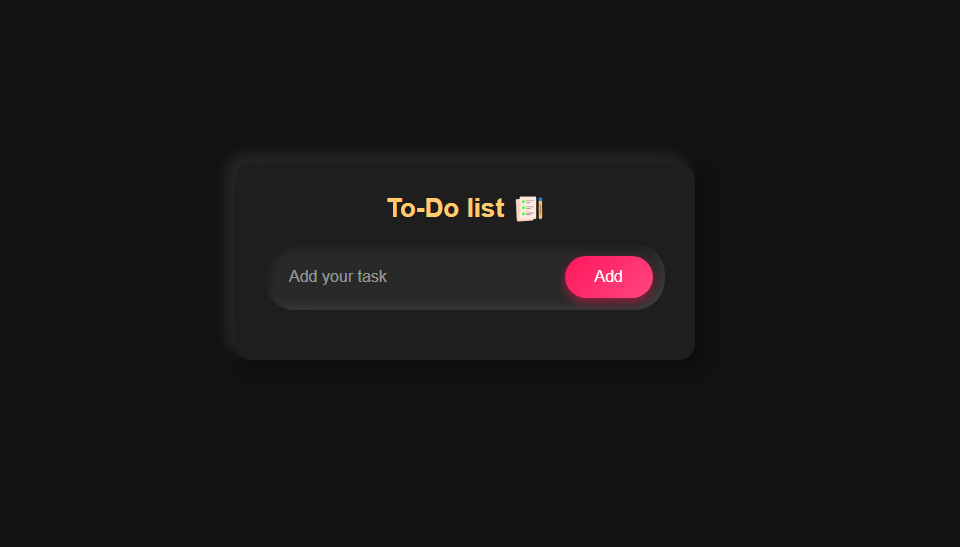
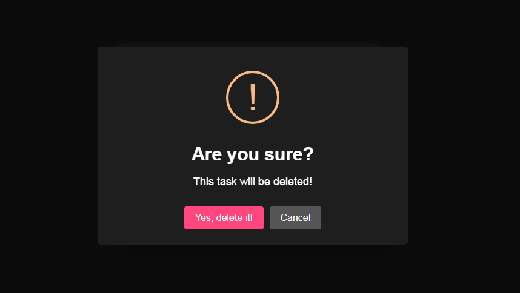
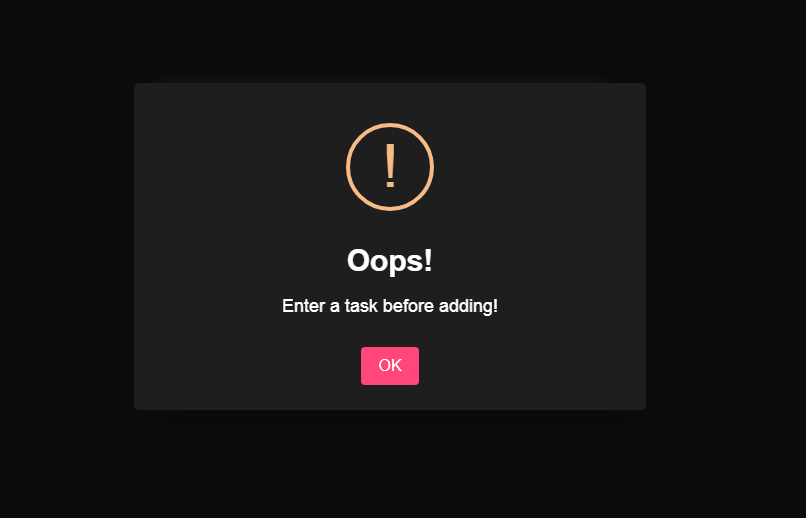

# 📝 To-Do List

A **minimalist and dark-themed** To-Do List web application built using HTML, CSS, SweetAlert2 and JavaScript. It allows users to add, delete, and mark tasks as completed. The app supports **local storage** to save tasks even after refreshing the page.

---

## 🚀 Features

- 🌓 **Dark Mode** for a sleek and modern look
- ✅ **Add, Remove, and Complete Tasks** effortlessly
- 🔄 **Persistent Storage** (Tasks remain saved in Local Storage)
- 🎨 **Minimal & Responsive Design**
- 🔔 **Custom Alerts** using SweetAlert2
- 🏎 **Smooth UI Animations** (Fade-in, Fade-out, Hover effects)

---

## 📸 Preview

<p align="center">
  
  
</p>

<p align="center">
  
  
</p>

---

## 🛠 Tech Stack

- **HTML5** – Structure of the app
- **CSS3** – Styling with a dark mode UI
- **JavaScript (ES6)** – Functionality & Local Storage
- **SweetAlert2** – Custom alert messages

---

## 🔧 Installation & Setup

1. **Clone the repository**

   ```bash
   git clone https://github.com/ajeetverma01/To-Do-List-Maker.git
   cd To-Do-List-Maker
   ```

2. **Open `index.html` in your browser**

---

## 🎯 Usage

- **Enter a task** in the input box and press **Add**
- **Click on a task** to mark it as **completed**
- **Click the ❌ button** to delete a task
- Tasks are **saved automatically** in Local Storage

---


## 📜 License

This project is **open-source** and available under the **MIT License**.

---

## 📩 Contact

For any queries or suggestions, connect with me on:

- **[GitHub](https://github.com/ajeetverma01)**
- **Email**: [av401402@gmail.com](mailto:av401402@gmail.com)

---

⭐ **If you like this project, give it a star on GitHub!** ⭐

---

Made with ❤️ by [Ajeet Verma](https://github.com/ajeetverma01)

